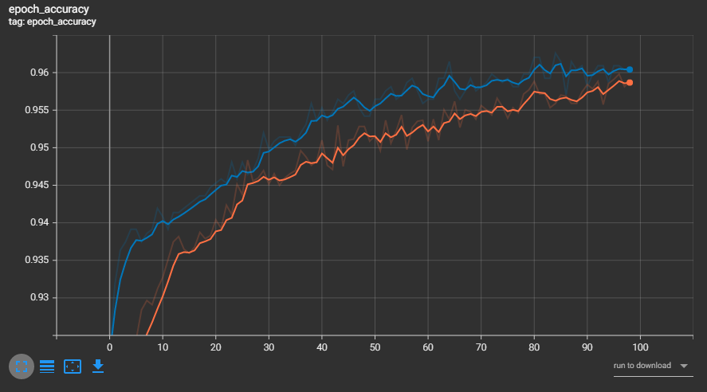
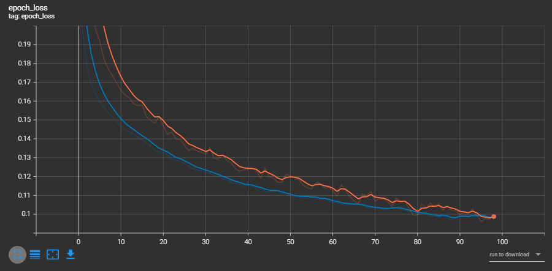
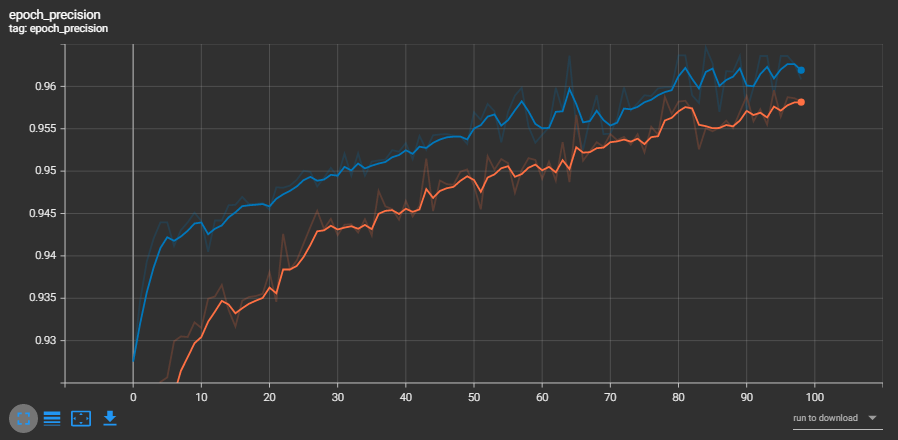
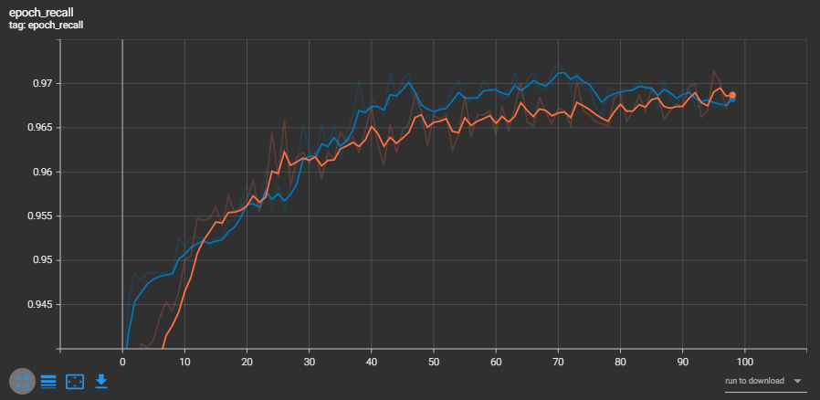
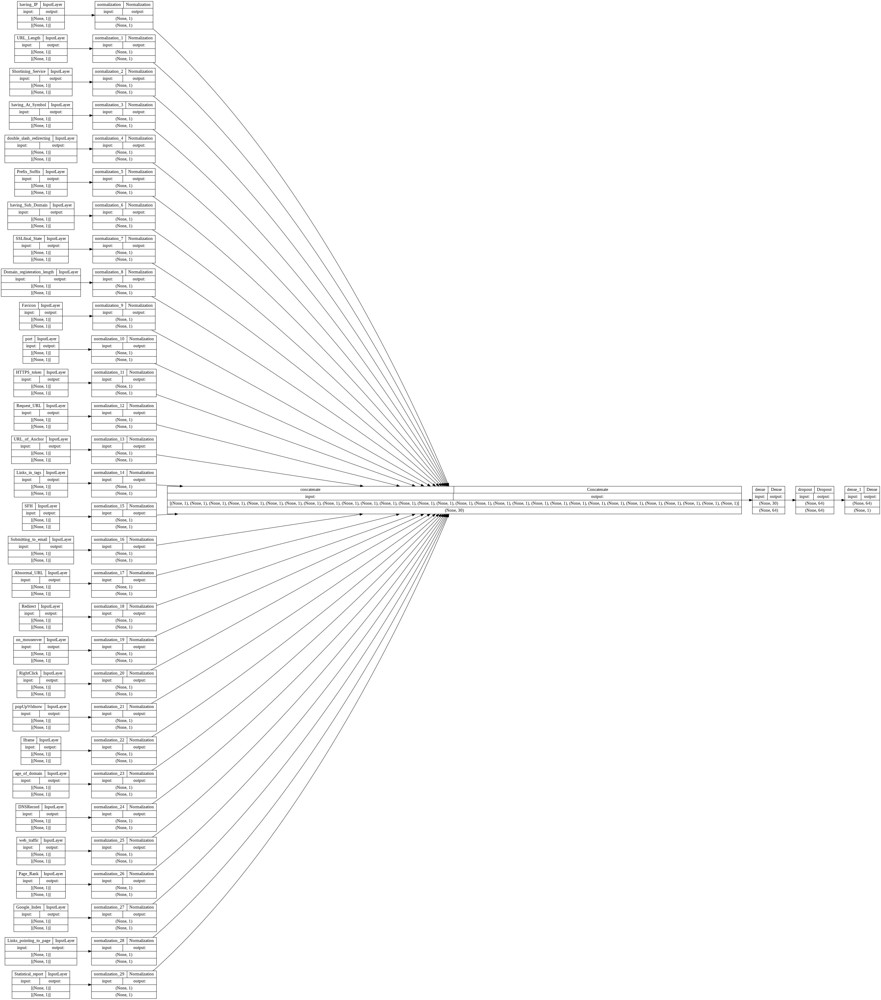
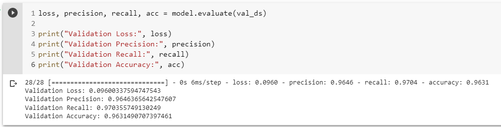

# Shreyas-Vedpathak-HP-ML-Hackathon

This repository contains my submission to HP Machine Learning Online Hackathon 2022.

## Deliverables

1. [Notebook](deliverables/HP_Machine_Learning_Hackathon_Notebook.ipynb)
2. [PPT](deliverables/HP%20ML%20Hackthon%20PPT.pptx)
3. [Submission (.csv)](deliverables/scratch_model_leakyrelu_64_dense.csv)

## Learning Curves

**Note: Orange line is for train data, blue line is for validation data**

1. Accuracy vs. Epochs:

2. Loss vs. Epochs:

3. Precision vs. Epochs:

4. Recall vs. Epochs:

5. Model Architecture:

6. Model Evaluation:

